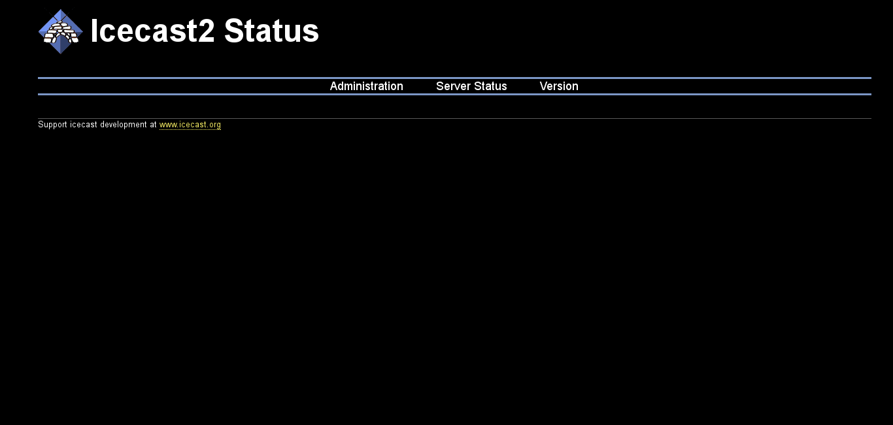
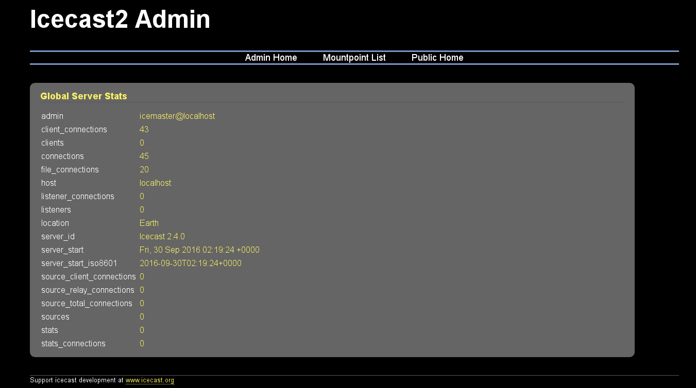

Es posible administrar el servidor web mediante una interfaz web. Para ello, procederemos a abrir un navegador web y colocar la **dirección IP** o **nombre de dominio** del servidor, seguido del número de puerto. En el siguiente ejemplo se emplean [valores ficticios, definidos en un ejemplo anterior](broadcasting/#como-transmitir): 

```bash
http://192.168.0.232:8000
```

Iniciamos sesión como **administrador** teniendo en cuenta las [credenciales que hayamos definido en el archivo de configuración](configuracionGeneral/#usuarios-y-contrasenas). Al acceder, veremos la siguiente página: 



Al hacer clic sobre el menu **Administration** veremos los datos del servidor: 



Si damos clic sobre **Mountpoint List** veremos listados los clientes que se encuentran transmitiendo. Naturalmente, la página se verá vacía si nadie está transmitiendo contenido: 


Cuando un usuario comienza a transmitir contenido, automáticamente aparece listado en la sección **Mountpoint List**: 


!!!done "Reproducir flujo de audio"
	En la imagen de arriba pueden visualizarse tres íconos: al hacer clic sobre alguno de ellos se descargará una lista de reproducción en un formato determinado que podremos abrir y reproducir en cualquier reproductor de audio. 

La información anterior aparecerá listada también al pié de la página de **Administration**: 


