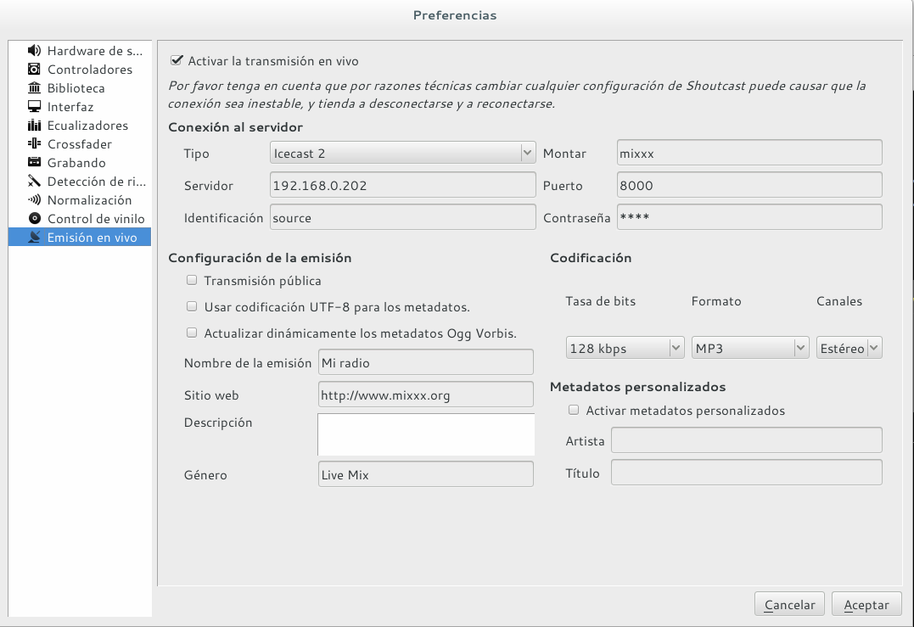

Icecast es solamente un servidor de streaming. Tendremos que proporcionar una fuente de audio y/o video para que el servidor lo retransmita entre los clientes de la red. 

Existen [varias herramientas para este cometido](http://icecast.org/apps/). En el presente tutorial utilizaremos una de ellas llamada **Mixxx** la cual podremos descargar desde los siguientes enlaces: 

  * [Mixxx (32 bits)](http://downloads.mixxx.org/mixxx-2.0.0/mixxx-2.0.0-win32.exe)

  * [Mixxx (64 bits)](http://downloads.mixxx.org/mixxx-2.0.0/mixxx-2.0.0-win64.exe)

## Transmitiendo con Mixxx

En la siguiente captura, podemos ver un ejemplo de opciones de configuración del programa Mixxx, al cual accedemos yendo al `Menu > Opciones > Preferencias`.



Donde:

1. **Activar la transmisión en vivo**: envía la reproducción actual hacia el servidor de audio.

2. **Conexión al servidor**: 
	* **Tipo**: Seleccionar tipo de servidor (Icecast, ShoutCast, etc.)
	* **Servidor**: Dirección IP o nombre de dominio del servidor de audio.
	* **Identificación**: Usuario autorizado para realizar _streaming_. Por defecto, el usuario es `source`.
	* **Montar**: Nombre del punto de montaje. Modificar a elección. 
	* **Puerto**: número de puerto donde _escuchará_ el servicio. Modificar a elección.
	* **Contraseña**: contraseña del usuario `source`.
3. **Codificación**: formato, _bitrate_ y canales del audio de salida. 

4. **Metadatos personzalidados**: sobreescribe los metadatos propios del audio en reproducción. 

5. **Configuración de la emisión**: codificación y metadatos de la transmisión.

### Streaming en mp3
Si deseamos transmitir en formato mp3 [tendremos que incluir algunas librerías](https://www.mixxx.org/wiki/doku.php/internet_broadcasting#mp3_streaming). 

En sistemas **GNU/Linux**, bastará con ejecutar el siguiente comando: 

```bash
sudo apt install libmp3lame0
```
Si utilizamos un sistema **Windows**, tendremos que completar los siguients pasos: 

1. Descargar la librería `libmp3lame` desde [el siguiente enlace](http://www.rarewares.org/mp3-lame-libraries.php) teniendo en cuenta la arquitectura de nuestro sistema (32 o 64 bits).
2. Descomprimir el archivo descargado con algún gestor de archivadores como, por ejemplo, [7-zip](http://www.7-zip.org/).
3. Copiar el archivo `libmp3lame.dll` **dentro de la carpeta de instalación de Mixxx** (generalmente es `C:\Archivos de programa\Mixxx\`.
4. Si estamos usando **Mixxx** en su versión 1.11 o anterior, es necesario renombrar el archivo `libmp3lame.dll` como `lame_enc.dll`.