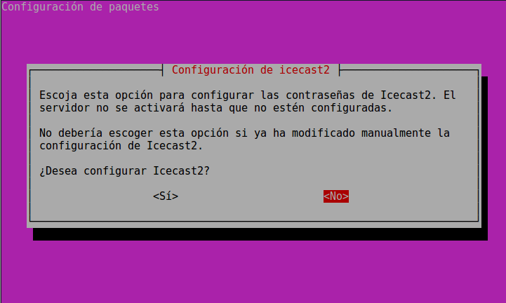

Instalamos **icecast2** y **códecs para manejo de formatos de audio y video libres**. Nos vamos a una terminal y tecleamos:

```bash
sudo apt-get install icecast2 vorbis-tools ffmpeg2theora oggfwd
```

Al instalar icecast, nos aparecerá una pantalla como la que sigue: 



No hay que alarmarse. Respondemos que **NO** ya que vamos a configurar el servicio en el paso siguiente. 