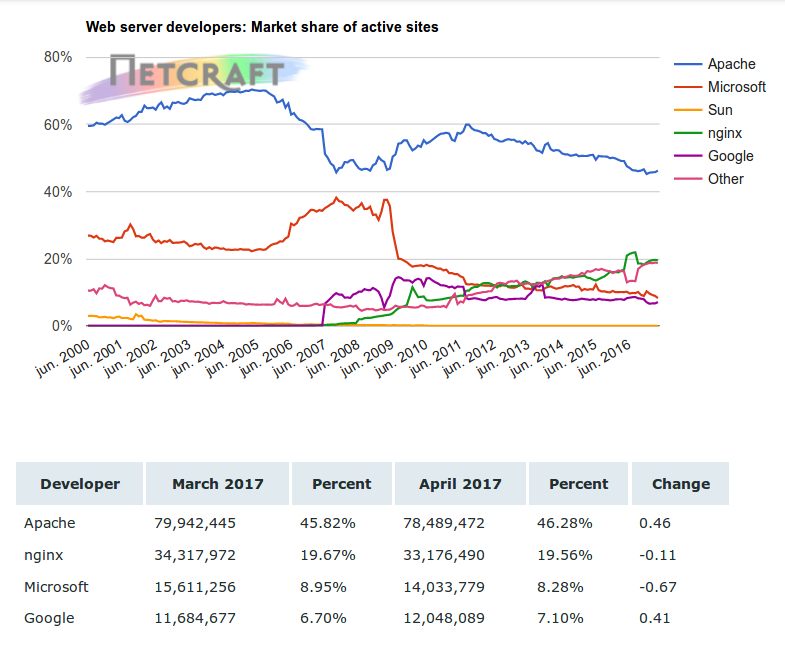

Se denomina **LAMP** a un grupo de software de código libre que se instala normalmente en conjunto para habilitar un servidor para alojar sitios y aplicaciones web dinámicas. Este término en realidad es un acrónimo que representa un sistema operativo **GNU/Linux** con un servidor web **[Apache](https://httpd.apache.org/)**, donde los datos del sitio son almacenados en base de datos **[MySQL](https://www.mysql.com/)** o **[MariaDB](https://mariadb.org/)** y el contenido dinámico es procesado con **[PHP](https://secure.php.net/)**.

!!!note "Acrónimos"
	Como de describe más arriba, **LAMP** es un acrónimo de **L**inux, **A**pache, **M**ySQL y **P**HP. Si esta pila o _stack_ de aplicaciones se ejecuta en Microsoft Windows se denomina **WAMP** y **MAMP** si se corre sobre MAC OS X. 

## Apache

El servidor **HTTP Apache** es un servidor web HTTP de código abierto, para plataformas Unix (BSD, GNU/Linux, etc.), Microsoft Windows, Macintosh y otras. 

El servidor Apache es desarrollado y mantenido por una comunidad de usuarios bajo la supervisión de la [Apache Software Foundation](https://www.apache.org/) dentro del proyecto HTTP Server (httpd).

!!!quote ""
	Apache tiene amplia aceptación en la red: desde 1996, Apache, es el servidor HTTP más usado. 

Jugó un papel fundamental en el desarrollo fundamental de la World Wide Web y alcanzó su máxima cuota de mercado en 2005 siendo el servidor empleado en el 70% de los sitios web en el mundo, sin embargo ha sufrido un descenso en su cuota de mercado en los últimos años. En 2009 se convirtió en el primer servidor web que alojó más de 100 millones de sitios web.

_Fuente: [Wikipedia](https://es.wikipedia.org/wiki/Servidor_HTTP_Apache)  |  [Netcraft](https://news.netcraft.com/archives/2017/04/21/april-2017-web-server-survey.html)_

## MySQL
**MySQL** es un sistema de gestión de bases de datos relacional desarrollado bajo licencia dual GPL/Licencia comercial por Oracle Corporation y está considerada como la base datos open source más popular del mundo y una de las más populares en general junto a **Oracle** y **Microsoft SQL Server**, sobre todo para entornos de desarrollo web.

MySQL fue inicialmente desarrollado por MySQL AB (empresa fundada por David Axmark, Allan Larsson y Michael Widenius). MySQL A.B. fue adquirida por Sun Microsystems en 2008, y ésta a su vez fue comprada por Oracle Corporation en 2010.

_Fuente: [Wikipedia](https://es.wikipedia.org/wiki/MySQL)_

## MariaDB
**MariaDB** es un sistema de gestión de bases de datos derivado de **MySQL** con licencia GPL (General Public License). Está desarrollado por Michael (Monty) Widenius (fundador de MySQL) y la comunidad de desarrolladores de software libre. Tiene una alta compatibilidad con MySQL ya que posee las mismas órdenes, interfaces, APIs y bibliotecas, siendo su objetivo poder cambiar un servidor por otro directamente. 

Este SGBD surge a raíz de la compra de Sun Microsystems -compañía que había comprado previamente MySQL AB- por parte de Oracle. MariaDB es un [fork](https://es.wikipedia.org/wiki/Bifurcaci%C3%B3n_(desarrollo_de_software)) directo de MySQL que asegura la existencia de una versión de este producto con licencia GPL. Monty decidió crear esta variante porque estaba convencido de que el único interés de Oracle en MySQL era reducir la competencia que MySQL suponía para el mayor vendedor de bases de datos relacionales del mundo, que es Oracle.

_Fuente: [Wikipedia](https://es.wikipedia.org/wiki/MariaDB)_

## PHP

**PHP** es un acrónimo recursivo que significa PHP Hypertext Preprocessor (inicialmente PHP Tools, o, Personal Home Page Tools). Publicado con la PHP License, la Free Software Foundation considera esta licencia como software libre. Se trata de un lenguaje de programación de uso general de código del lado del servidor originalmente diseñado para el desarrollo web de contenido dinámico. 

PHP puede ser desplegado en la mayoría de los servidores web y en casi todos los sistemas operativos y plataformas sin costo alguno. El lenguaje PHP se encuentra instalado en más de 20 millones de sitios web y en un millón de servidores. El número de sitios basados en PHP se ha visto reducido progresivamente en los últimos años, con la aparición de nuevas tecnologías como Node.JS, Golang, ASP.NET, etc. El sitio web de Wikipedia está desarrollado en PHP. Es también el módulo Apache más popular entre las computadoras que utilizan Apache como servidor web.

Permite la conexión a diferentes tipos de servidores de bases de datos tanto SQL como NoSQL tales como MySQL, PostgreSQL, Oracle, ODBC, DB2, Microsoft SQL Server, Firebird, SQLite o MongoDB.

PHP también tiene la capacidad de ser ejecutado en la mayoría de los sistemas operativos, tales como Unix (y de ese tipo, como Linux o Mac OS X) y Microsoft Windows, y puede interactuar con los servidores de web más populares.

_Fuente: [Wikipedia](https://es.wikipedia.org/wiki/PHP)_