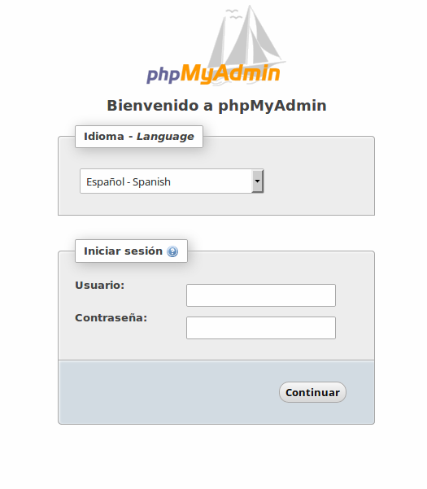

!!! warning "Ingreso de datos"
	Durante la instalación se solicitará en varias ocasiones el ingreso de información por parte del usuario. Por ejemplo, la contraseña del usuario root de la base de datos, o el tipo de servicio a instalar si usamos `tasksel`. Conviene prestar atención en cada paso para evitar errores de configuración. 

Para disponer de un servidor web **LAMP** ejecutaremos los comandos que se indican a continuación. 

```bash
sudo apt install lamp-server^
```
O bien: 

```bash
sudo apt install tasksel
```
Adicionalmente podemos instalar un gestor para nuestra base de datos, llamado **phpmyadmin** (junto a algunas librerías extra), ejecutando el siguiente comando: 

```bash
sudo apt install phpmyadmin php-gettext php-mbstring
```

##Verificando la instalación

Para verificar el correcto funcionamiento del servidor, seguiremos los siguientes pasos:

### Apache

Abrimos el navegador web y nos dirigimos a la siguiente dirección: `http://nombreDominioServidor` o `http://direccionIPServidor`. En cualquier caso deberíamos visualizar la página de bienvenida del servidor web:


### PHP

Dentro de la carpeta raíz por defecto del servidor web `/var/www/html`, creamos un archivo con el nombre `info.php` (en realidad, se puede llamar como prefieras):

```bash
sudo vim /var/www/html/info.php
```
Y agregaremos al archivo el contenido:

```php
<?php
phpinfo();
?>
```
Luego de guardar los cambios al archivo, abrimos un navegador web y visitamos la dirección `http://nombreDominioServidor/info.php` ó `http://direccionIPServidor/ìnfo.php` y deberíamos la página de información sobre php:


### phpMyAdmin
Abrimos nuestro navegador y nos dirigimos a `http://nombreDominioServidor/phpmyadmin` ó `http://direccionIPServidor/phpmyadmin`. Veremos una página similar a ésta: 



