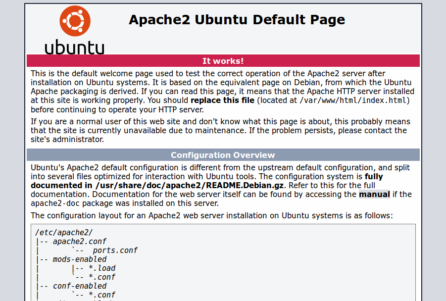

Para verificar el correcto funcionamiento del servidor, seguiremos los siguientes pasos:

### Apache

Abrimos el navegador web y nos dirigimos a la siguiente dirección: `http://nombreDominioServidor` o `http://direccionIPServidor`. En cualquier caso deberíamos visualizar la página de bienvenida del servidor web:




### PHP

Dentro de la carpeta raíz por defecto del servidor web `/var/www/html`, creamos un archivo con el nombre `info.php` (en realidad, se puede llamar como prefieras):

```bash
sudo vim /var/www/html/info.php
```
Y agregaremos al archivo el contenido:

```php
<?php
phpinfo();
?>
```
Luego de guardar los cambios al archivo, abrimos un navegador web y visitamos la dirección `http://nombreDominioServidor/info.php` ó `http://direccionIPServidor/ìnfo.php` y deberíamos la página de información sobre php:


### phpMyAdmin
Simplemente, abrimos nuestro navegador y nos dirigimos a `http://nombreDominioServidor/phpmyadmin` ó `http://direccionIPServidor/phpmyadmin`. Veremos una página similar a ésta: 

