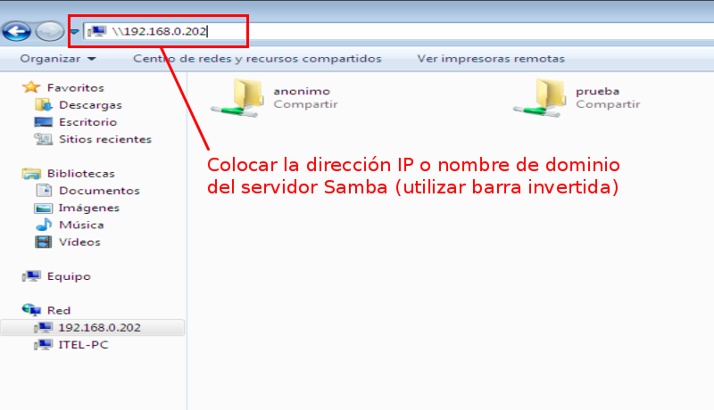
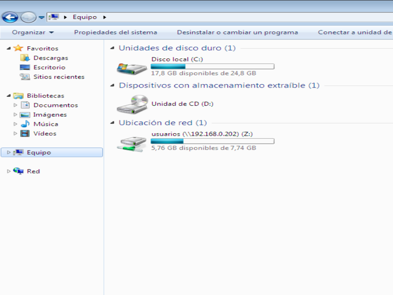

Si todo quedó correctamente configurado, podremos acceder a los recursos compartidos por el servidor Samba desde una máquina con el sistema Windows.

## Accediendo a las carpetas compartidas de manera temporal

Para ello, tendremos que abrir con el explorador de Windows la dirección IP del servidor Samba (**usar barra invertida \**), de la siguiente manera: 

!!!note 
		El acceso a las carpetas compartidas **no es permanente y se perderá cuando reiniciemos la maquina Windows**. Para que los recursos compartidos estén disponibles cuando inicie el sistema, seguí las instrucciones que se detallan a continuación.
 
## Accediendo a las carpetas compartidas de forma permanente

Abrimos el **Explorador de Windows** y hacemos clic derecho en **Equipo** y seleccionaremos la opción "Conectar a una unidad de red" 

Luego ingresamos la **dirección IP** o el **nombre del dominio** del servidor Samba seguido del nombre de carpeta que queremos montar (usar barras invertidas):

Finalmente veremos la carpeta compartida y que estará disponible cada vez que iniciemos sesión:

Repetiremos el procedimiento con cada carpeta alojada en servidor Samba a la que deseemos acceder y para la cual poseamos los permisos de lectura y escritura correspondientes:

Nota: en el ejemplo, se inició sesión en Windows con el usuario de Samba/Windows llamado **prueba**. La unidad de red con su nombre pertenece a dicho usuaruio. 