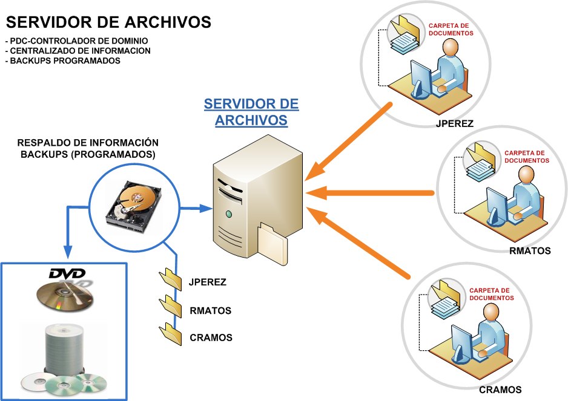

Es posible que necesitamos que **cada usuario del sistema sea capaz de leer y escribir en su directorio de trabajo vía **Samba**, según el siguiente esquema: 

<br />


Para ello agregamos al archivo de configuración `/etc/samba/smb.conf` debajo del bloque `[global]`:

```apache
[homes]
	# Comentario
	comment = Carpeta personal de cada usuario
	
	# La variable %S es reemplazada por el nombre 
	# del usuario que inicia sesión
	valid users = %S

	# ¿Se puede escribir dentro de la carpeta?
	writable = yes

	# ¿La carpeta será visible por el resto de los usuarios?
	browseable = no
```

Luego, reiniciamos Samba (lo haremos cada vez que modifiquemos el archivo de configuración):

```apache
sudo service smbd restart
```

