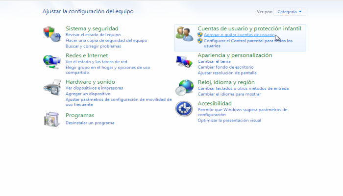
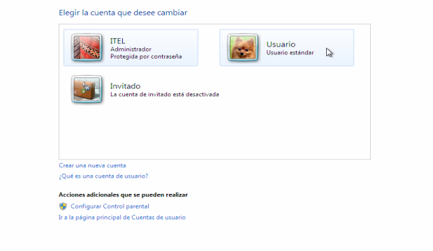
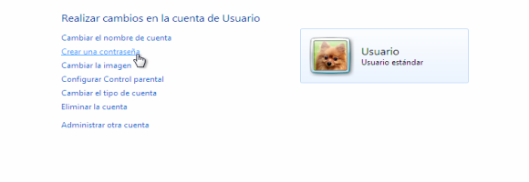
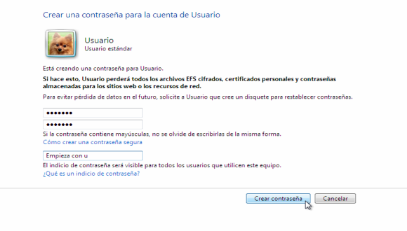

# Gestión de usuarios
Para compartir carpetas entre equipos con **Windows** y **GNU/Linux**, tendremos que configurar usuarios en ambos sistemas.  

!!!done "Sobre los usuarios"
		Es recomendable, aunque no excluyendete,  disponer de **los mismos usuarios** tanto en el servidor **SAMBA**, como en **Windows** para un correcto funcionamiento del servicio.

## Creación de usuarios en GNU/Linux
A continuación, repasaremos el modo de creación de usuarios en GNU/Linux:

```bash
sudo adduser usuario
```
Donde `usuario` es el nombre de usuario que deseamos crear. El mismo nombre de usuario debe existir en Windows. Recordar que en GNU/Linux, los nombres de usuario son sensibles a letras mayúsculas y minúsculas. 

## Creación de grupos en GNU/Linux 
Cuando creamos un usuario en GNU/Linux, automáticamente **el sistema crea un grupo con el mismo nombre que el usuario**. Sin embargo, podemos agregar los grupos que querramos de la siguiente manera: 

```bash
sudo addgroup nuevo_grupo
```
Donde `nuevo_grupo` es el nombre de grupo que deseamos crear. 


## Agregando usuarios a un grupo en GNU/Linux 

Podemos modificar o agregar los grupos a los que pertenece el usuario de la siguiente manera: 

```bash
sudo usermod -G grupo1,grupo2 usuario
```
Donde `usermod` es el comando para agregar al usuario llamado `usuario` a los grupos `grupo1` y `grupo2`  

!!!tip "Gestionando usuarios y grupos de manera simultánea"
		Es posible crear un **usuario** y **agregarlo a un grupo** determinado por nosotros, **de manera simultánea**:

		```apache
		sudo useradd usuario -m -G users
		```

		Pero si usamos este método, deberemos configurar la contraseña del usuario en un segundo paso: 


		```apache
		sudo passwd usuario
		```


## Verificando a que grupos pertenece un usuario en GNU/Linux
Para verificar el/los grupo/s a los que pertenece el usuario, ejecutamos: 

```apache
sudo id usuario
```
Donde `usuario`, es el usuario que deseamos investigar. 

## Agregando usuarios al servidor SAMBA 
Los usuarios ya fueron creados en GNU/Linux. Sólo resta agregarlos al servidor SAMBA de la siguiente manera: 

```apache
sudo smbpasswd -a usuario
```

Donde `usuario` es el usuario al que deseamos agregar a SAMBA. El sistema nos solicitará la contraseña del usuario en SAMBA que deberá ser la misma que en Windows.

## Creación de usuario en Windows 7
Para el correcto funcionamiento de SAMBA es recomendable que existan en Windows los mismos usuarios que en el servidor de compartición. En otro tutorial se explica como crear y gestionar los usuarios en GNU/Linux. A continuación, se detallan los pasos para la creación de usuarios en Windows 7. 

### Paso 0


### Paso 1


### Paso 2


### Paso 3


### Paso 4


### Paso 5


### Paso 6


